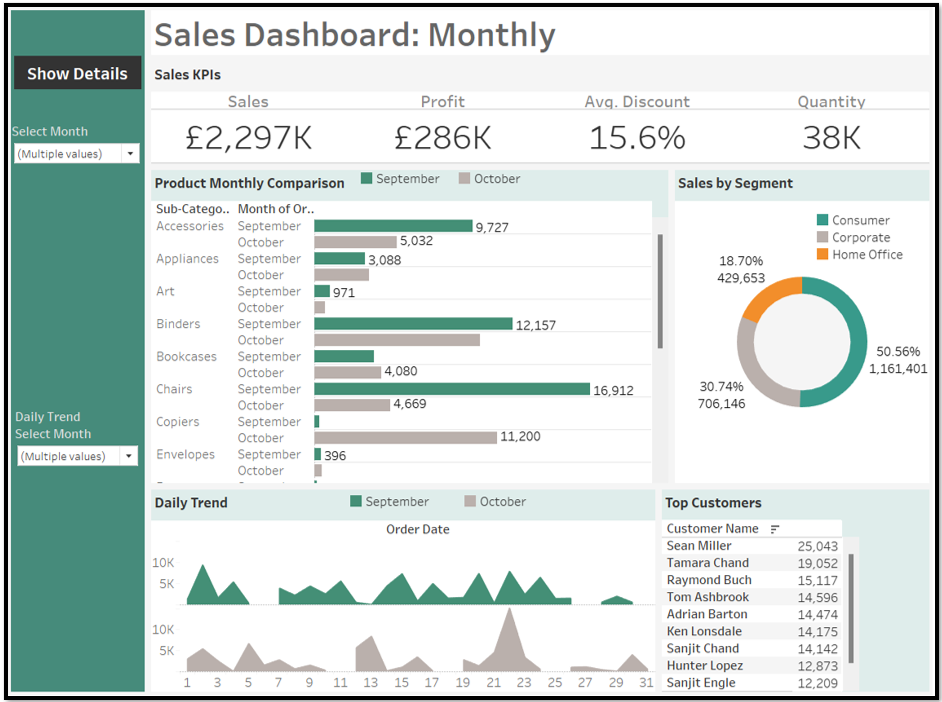
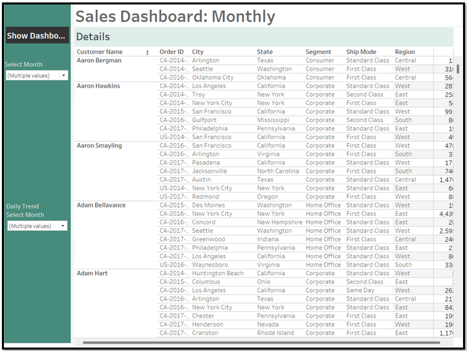
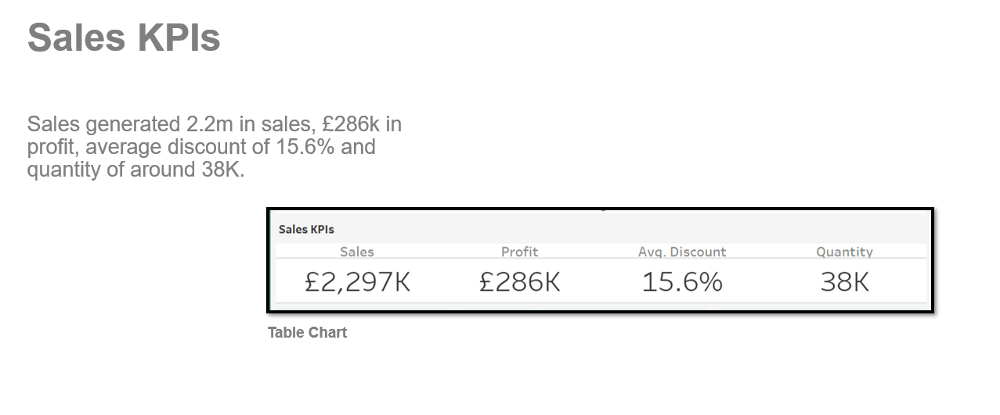
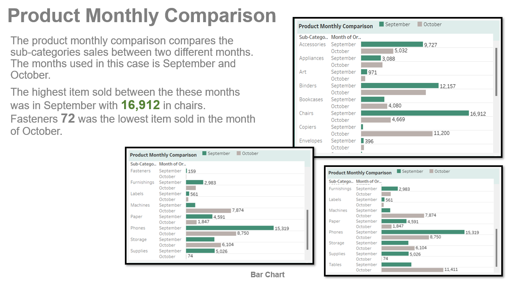
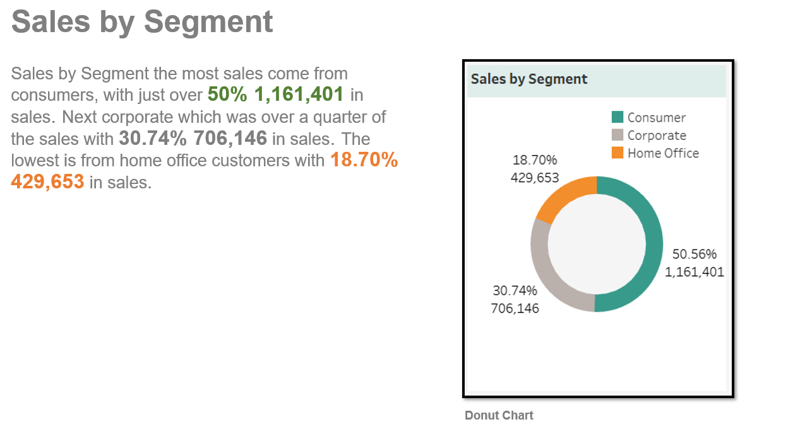
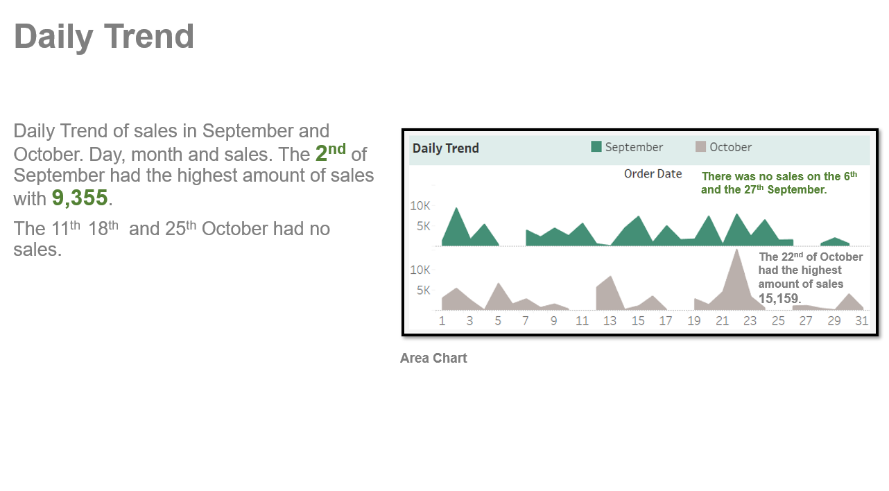
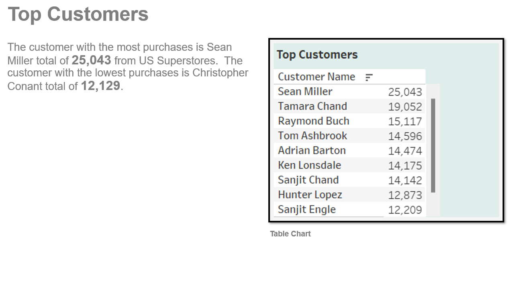
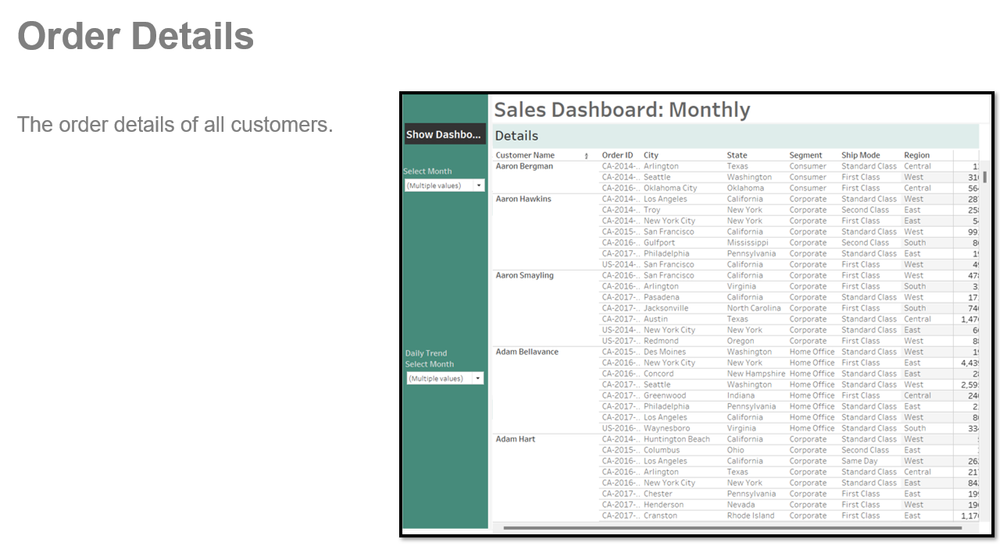

# Sales-Dashboard-Monthly
## US Superstore
### Tableau dynamic dashboard 
  

### Sales monthly dashboard about product comparison and daily trends  US Superstore data from the months of September and October 2017. Also, overall sales KPIs, sales by segment and top customers, using Tableau for the visualization.

### In this report the focus I will on the US Superstore 2017 data of US sales and profits from the months of September and October. 

### I will cover: 

<li>Sales KPIs. 
<li>Product Monthly Comparison. 
<li>Sales by Segment. 
<li>Daily Trend.
<li>Top Customers. 

### Software Used: 
Tableau 

Charts Used: Table Chart X2 , Bar Chart, Double Area Chart and Donut Chart. 

   

## Summary 

### In this report I analysed: 

<li>Sales KPIs. 
<li>Product Monthly Comparison. 
<li>Sales by Segment. 
<li>Daily Trend.
<li>Top Customers. 

## In September 15,319 phones were sold reasons for this could be that new phones got released that month and students also start their classes that month. Sales by Segment just over half of the sales come from normal consumers 50.56% 1,161,401. The 22nd of October had the highest amount of sales 15,159. 
  
[Live Link](https://public.tableau.com/views/SalesDashboardMonthly_16799558340840/Dashboard1?:language=en-GB&:display_count=n&:origin=viz_share_link)
  
  
  

